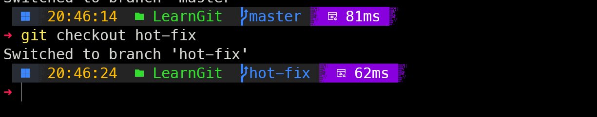
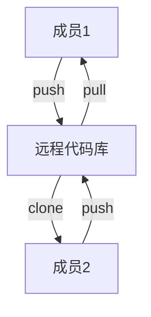

## 设置用户签名
设置用户签名（用户名和邮箱）

```bash
git config --global user.name <用户名>
git config --global user.email <邮箱>
```

上述的两个命令可以设置用户签名。我们可以在 `C:/User/你的用户名/.gitconfig` 文件当中看到用户签名是否设置成功。

## 初始化本地库
初始化本地库的命令：

```bash
git init
```

初始化可以向 Git 获取一个目录的管理权。我们在一个路径下面进行初始化之后，我们可以发现一个 `.git` 文件夹被创建了。

这个时候，一个主分支也被创建了，默认名为 `master` ，如果想更改，例如更改为 `main` ，可以使用命令：

```bash
git config --global init.defaultBranch main
```

## 查看本地库状态
### 查看当前提交状况
使用如下命令可以查看当前的提交状态：

```bash
git status
```

通常而言会出现这样的提示（初次查看）

```
On branch master

No commits yet

nothing to commit (create/copy files and use "git add" to track)
```

### 新增文件并查看
#### 新增文件
新建一个文件并写入一些东西，比如 `demo.txt` ，往里面随便写入一些东西，再输入 `git status` 时有如下的提示：

```
Untracked files:
  (use "git add <file>..." to include in what will be committed)
        demo.txt

nothing added to commit but untracked files present (use "git add" to track)
```

此时提示了我们应该追踪这个文件，也就是将文件放在暂存区。

使用如下命令：

```bash
git add demo.txt
```

此时再检查状态，也就追踪到了文件：

```
Changes to be committed:
  (use "git rm --cached <file>..." to unstage)
        new file:   demo.txt
```

#### 删除文件

我们会发现，如果 `demo.txt` 文件是你不想追踪的，那么可以直接使用提示的命令进行**删除**（注意此删除仅仅只是从暂存区删除，在你的工作区它没有被删除）。

```bash
git rm --cached demo.txt
```

此时再检查即可发现它又变成未被追踪的状态了。

### 提交本地库
#### 提交与检查
在 `git add` 追踪到文件之后，对单个文件我们可以进行提交了：

```bash
git commit -m "First Commit" demo.txt
```

提示如下：

```
 1 file changed, 3 insertions(+)
 create mode 100644 demo.txt
```

首次的版本号应该为 `100644` ，此时再检查就会有信息：

```
On branch master
nothing to commit, working tree clean
```

`working tree clean` 代表没有文件被修改，不需要进行新的追踪和提交。

#### 查看日志信息
查看日志可以用如下的命令：

```bash
git log
```

这个是详细的日志命令，此时会输出当前的提交信息，例如提交者和提交信息。

如果要看当前的指针指向哪里，我们可以使用

```bash
git reflog
```

此时的信息：

```
6f07f52 (HEAD -> master) HEAD@{0}: commit (initial): First Commit
```

我们能看到当前的提交信息和指针（指向当前的提交节点）。

需要注意的是两个命令看到的版本号是不一样的，`reflog` 看到的版本号只有前 7 位，相对更精简。

#### 修改与提交
此时对文件进行修改，我们再检查状态就会发现 Git 会提示我们修改没有被追踪，此时再用 `git add` 命令即可。再用 `git commit` 命令提交后，此时就会出现文件的更改信息：

```
[master 5954acd] Second Commit
 1 file changed, 1 insertion(+)
```

只要某行出现了改变，它就会提示改变。此时本地也不会出现副本，因为 Git 的工作原理依赖**指针**。

再查看日志：

```
commit 5954acdf70d7768e5f277de85ccb051ffd2fbf82 (HEAD -> master)
Author: xzqbear <xzqbear@mail.nankai.edu.cn>
Date:   Tue Dec 19 17:55:28 2023 +0800

    Second Commit

commit 6f07f522066bbc12450fba8632a7763bc54eefb5
Author: xzqbear <xzqbear@mail.nankai.edu.cn>
Date:   Tue Dec 19 17:43:20 2023 +0800
```

每次提交，我们总能看到每次提交的作者和时间。

## 版本穿梭
既然是版本管理，我们就需要能够回退，使用如下命令可以进行版本的回退：

```bash
git reset --hard <版本号>
```

这里的版本号可以是 `reflog` 当中看到的精简的版本号，比如我们刚刚做的操作和就可能是：

```bash
$ git reset --hard 6f07f52
HEAD is now at 6f07f52 First Commit
```

此时再查看日志：

```bash
6f07f52 (HEAD -> master) HEAD@{0}: reset: moving to 6f07f52
5954acd HEAD@{1}: commit: Second Commit
6f07f52 (HEAD -> master) HEAD@{2}: commit (initial): First Commit
```

第二次的提交仍然存在，但是提示是已经 `reset` ，我们再打开相应的 `demo.txt` ，我们可以发现文件的内容已经回退到第一次提交对应的内容了。

此时在本地的文件当中发生了什么？进入 `.git` 文件夹当中，我们看 `HEAD` 文件，内容如下：

```txt
ref: refs/heads/master
```

这个表明我们目前在 `master` 这个分支当中，再看这个路径对应的文件，内容：

```txt
6f07f522066bbc12450fba8632a7763bc54eefb5
```

这就是我们目前的版本号，如果再次 `reset` ，它就会更改为当前的版本。

`git reset` 版本穿梭向前向后都可以，只需要写相应的版本号就行。


## 分支

分支是程序设计流程的一个必要的环节，在程序正常运行的时候，可能需要一些紧急修复（例如网游修复服务器），那么常见的一个做法就是分出一个 `hot-fix` 分支，然后修复之后合并到现有的主分支当中。

同时，开发新的功能也可以切出一个新的分支，如果开发失败了，也仅仅只需要销毁分支即可。

### 查看分支
使用下面的命令可以查看分支：

```bash
git branch -v
```
得到的结果如下：

```bash
* master 5954acd Second Commit
```

### 创建新分支
我们使用如下的命令创建 `hot-fix` 分支：

```bash
git branch hot-fix
```

此时再看分支，可以看到：

```bash
  hot-fix 5954acd Second Commit
* master  5954acd Second Commit
```

这里的星号表示什么？表示我们的指针指向的是 `master` 分支的节点。下面我们考虑切换分支。

### 切换分支
```bash
git checkout hot-fix
```

使用上述的命令我们可以将指针指向 `hot-fix` 分支。

此时我们切换到了 `hot-fix` 分支，这个时候检查状态和提交内容都对应这个分支。

同时，这个时候的命令行窗口应该显示对应的分支：



如果在另一个分支上进行了更改，再切回来的时候，文件又变成了之前没有更改的样子，也就是说**每个分支的文件在不同的分支上会保留其状态**。

接下来我们再来看分支的合并。

### 合并分支
#### 正常合并
我们要把 `hot-fix` 分支合并到 `master`，那么该如何操作？

首先，我们应切换到 `master` 的分支上，然后用命令：

```bash
git merge hot-fix
```

此时 `hot-fix` 就被合并到 `master` 主支上，结果应如下：

```
Updating 5954acd..12ad2f1
Fast-forward
 demo.txt | 3 ++-
 1 file changed, 2 insertions(+), 1 deletion(-)
```

此时 `master` 主支上的文件也发生了更改，这是在正常合并的情形下的结果。正常合并是指**没有代码冲突**的合并，所以此时的合并也就没有什么好说的了。

需要注意的也就是使用 `merge` 命令的时候哪个是被合并的支，这是最需要注意的地方。

#### 冲突合并
什么时候会产生代码冲突？两个分支对同一个位置有两套完全不同的更改，此时的 Git 无法决定哪个更应该保留，那么就会出现**冲突合并**.

如果在 `merge` 的时候发生冲突,就会出现提示:

```
Auto-merging demo.txt
CONFLICT (content): Merge conflict in demo.txt
Automatic merge failed; fix conflicts and then commit the result.
```

如果检查 `status` 就会出现如下提示:

```
On branch master
You have unmerged paths.
  (fix conflicts and run "git commit")
  (use "git merge --abort" to abort the merge)

Unmerged paths:
  (use "git add <file>..." to mark resolution)
        both modified:   demo.txt

no changes added to commit (use "git add" and/or "git commit -a")
```

这个时候再打开冲突的 `demo.txt` 文件, 文件里面就会表明哪些内容出现了冲突:

```
<<<<<<< HEAD
这里是冲突行
=======
分支内容2
>>>>>>> hot-fix
```

等于号分隔的两段内容就是两个分支对应的内容, 它清楚地展示了为什么会出现冲突.

此时我们将文件更改为想要的样子, Git 加的特殊符号也要删掉. 保存之后, 再添加到暂存区并提交.

这个时候提交不要添加文件名, 也就是直接写:

```bash
git commit -m "merge branches"
```

如果再切换到 `hot-fix` 分支, 我们能发现内容没变, 也就是说冲突合并还是只更改使用 `merge` 时所在的那个分支.

## 团队协作
###  团队内协作
对于团队内的协作,我们可以用一个图来简单理解:


如果成员1将代码上传(push)到了远程代码库,别的成员如果没有代码,可以直接复制(clone)这些代码到本地,如果想要更改内容,此时要再次上传,其他成员要进行同步就可以直接pull,从而实现同步.
### 跨团队协作
跨团队协作里一个比较核心的概念就是 pull request , 它表示其他团队或者开发者更改了代码并提交时, 需要提交 pull request, 此时原来的团队就会进行检查, 通过之后就能合并了.


### Git远程命令
#### 远程别名
用 Github 创建一个仓库, 此时 Github 会给一个远程链接, 在本地使用命令:

```bash
git remote -v
```

上述的命令可以查看当前所有远程地址的别名. 如果想要起别名,可以使用:

```bash
git remote add <别名> <远程地址>
```

#### 仓库操作
推送本地分支到远程仓库:
```bash
git push <别名> <分支>
```

克隆操作:

```bash
git clone <远程地址>
```

将最新内容拉下来之后与当前本地分支直接合并:

```bash
git pull <远程库地址别名> <远程分支名>
```


